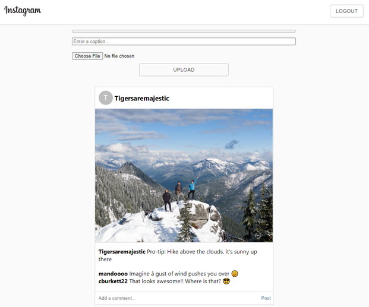

# Instagram

[Click here to see the application live!!](https://instagram-clone-71013.web.app/)

## Description
As a Full-Stack Web Developer, I have created an application that is a replica of the famous social media platform, Instagram. I have created this application so that it will allow users to create an account, make a post, and comment on other users posts. The technologies used in this application was ReactJS for the front end, and Firebase for the back end (user authentication and database logs for posts/comments).

## Table of Contents

* [Title](#Title)
* [Description](#Description)
* [Usage](#Usage)

## Usage
In order to make a post or comment on another users post, the user will need to either sign up, or login.

## Questions
Email: Coreyburkett22@gmail.com |
LinkedIn: www.linkedin.com/in/corey-burkett/

